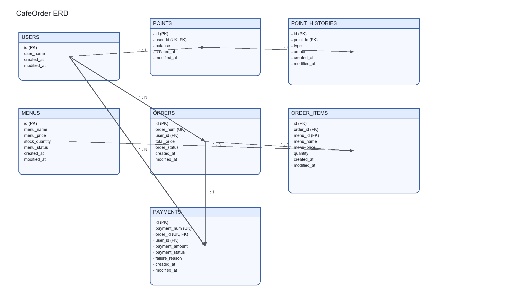

# CafeOrderSystem

다수 서버/인스턴스 환경에서도 안정적으로 동작하는 커피 주문 시스템입니다.

## 1) 프로젝트 목표

- 메뉴 조회
- 포인트 충전(1원 = 1P)
- 주문 생성 및 포인트 결제
- 결제 완료 주문 기반 인기 메뉴(최근 7일) 조회
- 결제 직후 외부 데이터 플랫폼으로 주문 데이터 전송(Mock)

## 2) 설계 의도

### 핵심 의도

1. **엔티티 중심 도메인 규칙 유지**
	- 서비스 레이어에서 계산/검증을 모두 처리하지 않고, 엔티티에서 상태 변경 규칙을 직접 보장합니다.
	- 예: `Point.charge/use`, `Order.addOrderItem/complete/fail`, `Menu.decreaseStock`

2. **주문 시점 스냅샷으로 정합성 유지**
	- `OrderItem`에 `menuName`, `menuPrice`를 복사 저장하여, 이후 메뉴 정보가 바뀌어도 과거 주문 데이터가 변형되지 않도록 설계했습니다.

3. **현금성 자산(포인트)과 재고에 대해 정합성 우선**
	- 동시성 경합 구간은 비관적 락으로 직렬화해 잔액/재고 불일치를 최소화했습니다.

4. **외부 API 호출과 핵심 트랜잭션 분리**
	- 결제 트랜잭션 내부에서 외부 호출을 직접 수행할 경우 외부 API 지연/실패가 DB 트랜잭션(락 점유)을 길게 만드는 위험을 분리하기 위해, `Facade + @Async`로 분리해 락 점유 시간을 줄였습니다.

## 3) 도메인 모델 / ERD


<p align="center">
  
</p>

## 4) API 명세서

<details>
<summary><strong>API 명세 펼치기 / 접기</strong></summary>

<br />

기본 성공 응답은 공통 포맷을 사용합니다.

```json
{
  "success": true,
  "code": "SUCCESS",
  "message": "요청이 정상 처리되었습니다.",
  "data": {}
}
```

에러 응답도 공통 포맷을 사용합니다.

```json
{
  "success": false,
  "code": "POINT_003",
  "message": "포인트 잔액이 부족합니다.",
  "data": null
}
```

### 4.1 메뉴 목록 조회

- `GET /api/menus`
- 응답: 메뉴 ID, 이름, 가격, 재고, 상태

### 4.2 인기 메뉴 조회(최근 7일 Top 3)

- `GET /api/menus/popular`
- 기준: 결제 완료(`COMPLETED`) 주문의 최근 7일간 OrderItem 건수 집계 (동일 주문 내 여러 개 주문 시 각각 카운트)

### 4.3 포인트 충전

- `POST /api/points/add?userId={userId}`
- Request Body

```json
{
  "amount": 10000
}
```

### 4.4 주문 생성

- `POST /api/orders`
- Request Body

```json
{
  "userId": 1,
  "items": [
	{ "menuId": 10, "quantity": 2 },
	{ "menuId": 20, "quantity": 1 }
  ]
}
```

### 4.5 주문 결제

- `POST /api/payments/orders/{orderId}`
- Request Body

```json
{
  "paymentAmount": 8000
}
```

</details>

## 5) 문제해결 전략 및 분석 내용

### A. 동시성 전략

#### 포인트(현금성 자산)

- `PointRepository.findByUserIdWithLock`에 DB 배타락(`PESSIMISTIC_WRITE`) 적용
- 목표: 다중 환경에서 충전/결제 경합 시 발생할 수 있는 갱신 누락(Lost Update)을 방지하고, 잔액이 음수가 되는 치명적 오류 원천 차단

#### 주문 재고

- **재고 차감 시점**: 주문 생성 시점에 즉시 차감 (결제 이전)
- 다건의 메뉴를 조회할 때 `findAllByIdInWithLock`을 사용하여 락 획득 후 재고 검증 및 차감 로직 수행 (※ 데드락 방지를 위해 메뉴 ID 정렬 후 락 획득)
- 목표: 한정된 인기 메뉴에 대한 동시 다발적 주문 시 초과 판매(Over-selling) 방지
- 설계 의도: 주문 생성 시점에 재고를 선점함으로써, 결제 시점의 재고 부족 문제를 사전 차단

#### 결제 멱등성

- `Payment` 엔티티의 `order_id`를 Unique Key로 설정하여 무결성 강제
- 목표: 네트워크 지연이나 클라이언트의 따닥(중복 요청) 등으로 인한 재진입 시, 기존 처리된 결제 결과를 반환하여 중복 결제 방지

### B. 데이터 정합성 전략

- 객체 지향적 책임 할당: 주문 총금액은 `Order` 엔티티가 `OrderItem`을 추가받을 때 스스로 누적 계산하도록 구현
- 스냅샷 패턴 적용: 메뉴 가격 인상 등 원본 데이터 변경 시 과거 영수증이 오염되는 것을 막기 위해 `OrderItem` 생성 시점에 `menuName`, `menuPrice`를 스냅샷으로 영구 보존
- 안전한 상태 전이: 주문 상태(`PENDING -> COMPLETED/FAILED`) 변경은 Setter를 열어두지 않고 도메인 엔티티의 비즈니스 메서드를 통해서만 가능하도록 강제

### C. 외부 플랫폼 전송 전략

- 트랜잭션 분리와 비동기 처리: `PaymentFacade` 계층을 두어 메인 결제 트랜잭션(`PaymentService`)이 커밋된 이후에 `DataPlatformService.sendAsync`가 호출되도록 구조화
- 목표: 외부 데이터 수집 플랫폼의 응답 지연이나 장애가 메인 결제 DB 락 점유 시간 연장으로 이어지는 병목 현상(장애 전파) 방지

## 6) 기술적 선택 이유

### 왜 비관적 락인가?

- 낙관적 락(Optimistic Lock): 트래픽 경합이 심할 경우 잦은 `ObjectOptimisticLockingFailureException`이 발생하며, 애플리케이션 단의 복잡한 재시도 로직 구현 및 커넥션 낭비가 우려되었습니다.
- 선택 이유: 본 과제의 핵심인 포인트와 재고 관리는 정합성이 1순위로 보장되어야 하는 도메인입니다. 충돌 발생 시 선점 잠금을 통해 요청을 직렬화하여 대기시키는 비관적 락이 데이터 무결성 보장과 구조적 안정성 측면에서 가장 적합하다고 판단했습니다.

### 왜 Facade + @Async 인가?

- 단일 서비스 클래스 안에서 외부 연동을 묶으면, 메인 도메인 로직과 외부 인프라 연동의 관심사가 혼재됩니다.
- 선택 이유: `Facade` 계층을 도입하여 결제 비즈니스 로직과 외부 데이터 전송 관심사를 깔끔하게 분리했습니다. 또한 `@Async`를 통한 비동기 처리로 사용자에게는 빠른 결제 응답을 제공하고, 외부 API 실패는 메인 로직에 영향을 주지 않도록 장애 격리(Fault Isolation) 및 에러 로그 처리를 구현했습니다.
